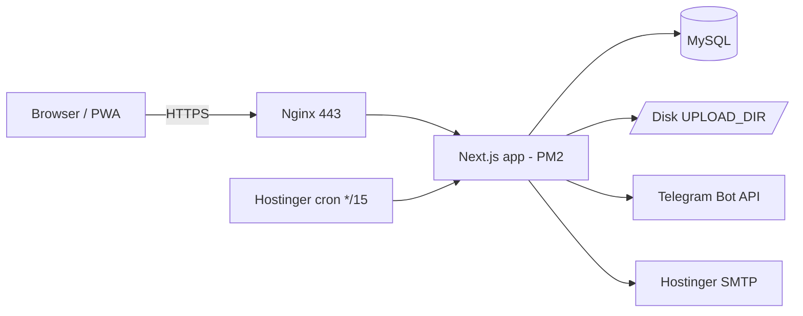

# PayTrack — Architecture Document

| | |
|---|---|
| **Product** | PayTrack — Go DinDin internal payment tracker |
| **Last updated** | 13 Jul 2026 |
| **Related** | `PRD.md` · `paytrack-handoff-spec.md` (schema/API detail) · `CLAUDE.md` |

This document describes *how the system is built and why*. Field-level schema, endpoint bodies, and deploy commands live in `paytrack-handoff-spec.md`; this is the higher-level picture and the rationale.

---

## 1. Overview

A single **Next.js** application (UI + API in one) talking to **MySQL**, storing files on **local disk**, sending reminders via a **Telegram bot**, and driven on a schedule by **Hostinger cron**. Everything self-hosted on Hostinger. No external paid services, no AWS.

## 2. Context diagram

```
                 ┌───────────────────────────── Hostinger box ──────────────────────────────┐
                 │                                                                            │
  Browser /PWA ──┼──► Nginx (443, SSL) ──► Next.js app (PM2, :3000) ──► MySQL (payments,users)│
  (4 users)      │                              │        │                                    │
                 │                              │        └──► Disk: UPLOAD_DIR (proof/instr.)  │
                 │                              │                                              │
   Hostinger cron ──►  POST /api/cron/reminders │                                              │
   (*/15 min)     │                              └──► Telegram Bot API ──► users' Telegram      │
                 │                              └──► Hostinger SMTP ──► login magic-links       │
                 └────────────────────────────────────────────────────────────────────────────┘
```



## 3. Components

| Component | Responsibility |
|---|---|
| **Next.js app** | Serves the React UI (ported from `paytrack.html`) and all `/api` route handlers. The only compute. |
| **`lib/status.ts`** | The state machine + the two hard rules + role checks. Every write passes through it. The heart of the system. |
| **MySQL (Prisma)** | `User`, `Payment`, `Attachment`, `PaymentEvent`. |
| **Disk (`UPLOAD_DIR`)** | Instruction files + proof, outside web root, streamed via an auth-gated route. |
| **Telegram bot** | Outbound notifications (event-driven + the 15-min digest). |
| **SMTP (Hostinger)** | Magic-link login emails. |
| **Cron** | Fires `/api/cron/reminders` every 15 min. |

## 4. Key data flows

**Raise a payment** — Requester submits form + optional file → API validates (Zod) → file saved to disk → `Payment` (status `REQUESTED`) + `Attachment` + `PaymentEvent(request)` created → Telegram → payer.

**Schedule** — Payer picks a date → `lib/status.ts` checks transition + **date present** → status `SCHEDULED`, `scheduledFor` set → event logged → Telegram → requester.

**Pay** — Payer uploads proof + optional note → status guard checks **proof present** → status `PAID` → event logged → Telegram → requester ("please confirm").

**Confirm** — Raising requester confirms → status `CONFIRMED` (terminal) → event logged.

**Reminder (cron, every 15 min)** — Secret-checked → within working hours → gather pending → one digest to payer (`lastRemindedAt` de-dupes) → overdue items also ping the requester → nothing sent once `PAID`.

## 5. Tech decisions & rationale

| Decision | Choice | Why |
|---|---|---|
| App shape | **Monolith** (single Next.js) | 4 users, one team — splitting into services is pure overhead. |
| Framework | **Next.js + TS** | Matches Go DinDin's existing stack; one app for UI + API. |
| Database | **MySQL** (Prisma) | Included on every Hostinger plan → ₹0. Data is small and relational. (Atlas M0 free is the Mongo alternative if preferred.) |
| Files | **Local disk** | No object storage needed at this volume; avoids S3/Blob cost and setup. |
| Notifications | **Telegram bot** | Free, instant, no template approval, no per-message cost. WhatsApp deferred (costs money). |
| Scheduling | **Hostinger cron** | Real cron already on the plan; no queue service needed. |
| Hosting | **Hostinger** (PM2 + Nginx) | Uses resources already paid for. No AWS/Vercel. |
| Auth | **Auth.js magic-link** | Don't build auth; 4-email whitelist is enough. |
| Scaling | **Vertical only** | This will never need horizontal scale; a single node is correct. |

## 6. Data model (summary)

`User` (name, email, role, telegramChatId) · `Payment` (amount in paise, payee, payFrom, purpose, status, dueDate, scheduledFor, paid/confirmed metadata) · `Attachment` (instruction|proof, stored on disk) · `PaymentEvent` (the thread **and** the audit log). `overdue` is derived, never stored. Full schema in the handoff spec.

## 7. State machine (summary)

`REQUESTED → SCHEDULED → PAID → CONFIRMED`, with `HOLD` and `CANCELLED` branches. Guards: `SCHEDULED` needs a date; `PAID` needs proof. Actor rules: only payer schedules/pays/holds; only the raising requester confirms. All enforced centrally in `lib/status.ts`. Full transition table in the handoff spec.

## 8. Security model

- **Auth:** email magic-link, restricted to a 4-email whitelist; no public signup.
- **Authorization:** role checks (`payer` vs `requester`) inside every write; the raising requester is the only one who can confirm their item.
- **Files:** stored outside the web root; never in `/public`; served only through an authenticated route.
- **Cron endpoint:** guarded by an `x-cron-secret` header (+ optional IP allow-list).
- **Secrets:** `.env` on the server, gitignored; never committed.
- **Money integrity:** stored as integer paise; formatted only at the UI edge.
- **Idempotency:** keys on `pay`/`confirm` to prevent double-posting.

## 9. Reminder subsystem

Event-driven pings fire immediately on the action (new request, paid→confirm, nudge). The **15-minute digest** is the only cron-driven piece: working-hours gated, de-duplicated via `lastRemindedAt`, escalates overdue items to the requester, and **stops the moment a payment is `PAID`**. Designed to inform, not spam.

## 10. Deployment topology

Single Hostinger box: **Nginx** terminates SSL (free Let's Encrypt) and proxies 443 → **Next.js** on `:3000`, kept alive by **PM2**. **Prisma** migrates the **MySQL** schema. **Cron** hits the reminder endpoint every 15 min. Uploads live in a persistent `UPLOAD_DIR`. Requires a **VPS or Node-capable (Cloud/Business)** plan — pure PHP shared hosting can't run Next.js.

## 11. Limits & scaling ceiling

Comfortable to well beyond the intended 4 users / low volume on a single small node. The first things that would ever need attention (only at much larger scale, unlikely here): moving files off local disk to object storage, and moving the reminder job to a durable queue. Neither is needed now.

## 12. Backup & recovery

Self-hosting means recovery is owned in-house: **nightly `mysqldump` + a copy of `UPLOAD_DIR`**, plus Hostinger's own backups. A restore should be tested once so it's known to work.

## 13. Risks & mitigations

| Risk | Mitigation |
|---|---|
| Hostinger plan can't run Node | Confirm Node support before deploy; fall back to Cloud/VPS tier (or PHP build). |
| Reminder spam annoys the payer | Working-hours gate, `lastRemindedAt`, hard stop on `PAID`. |
| Proof files lost (disk) | Nightly backup of `UPLOAD_DIR` + tested restore. |
| Hard rules bypassed via API | All writes go through `lib/status.ts`; UI checks are convenience only. |
| Notifications missed (Telegram not opened) | Move reminders to WhatsApp in Phase 3 if reliability demands it. |
